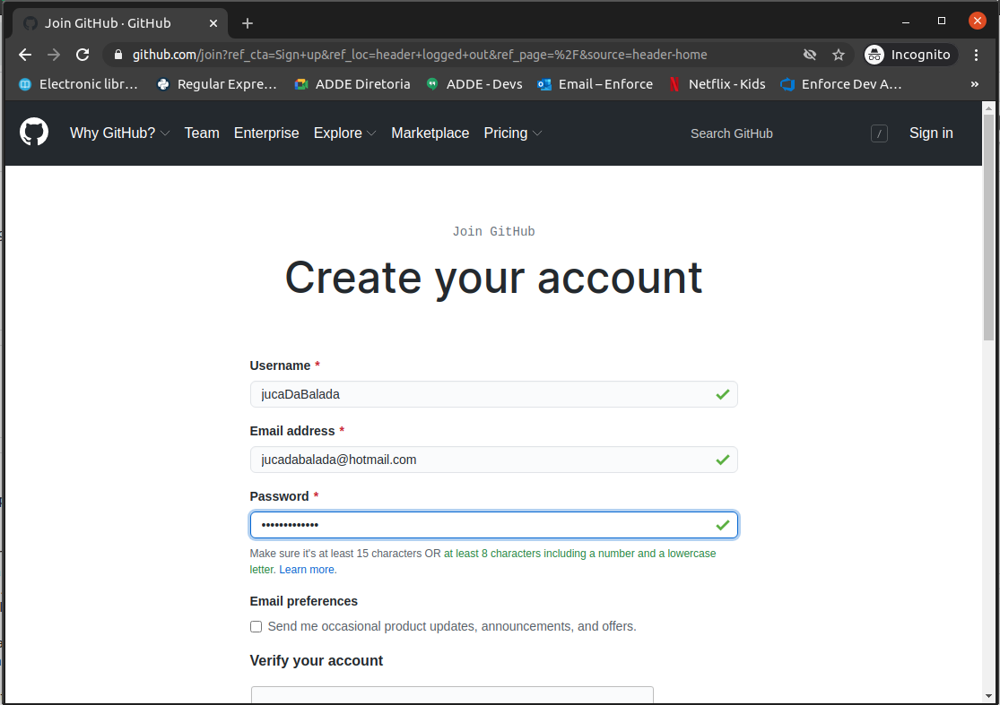
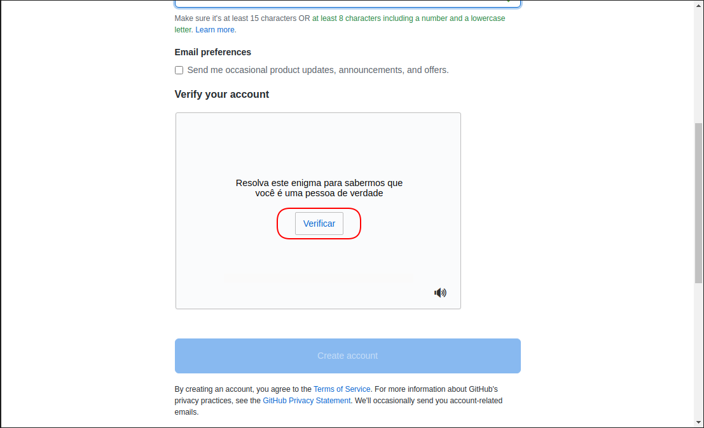
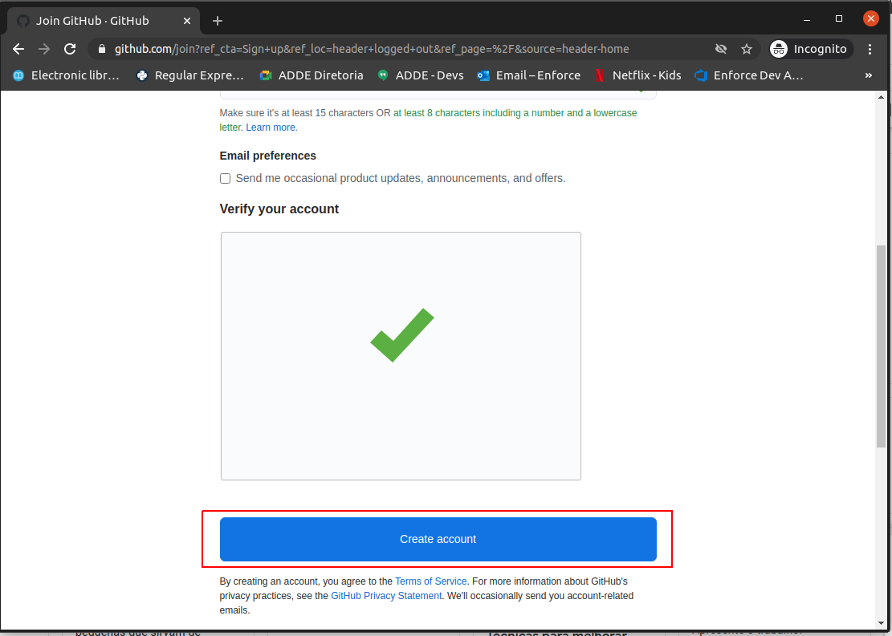
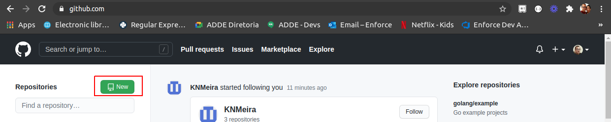
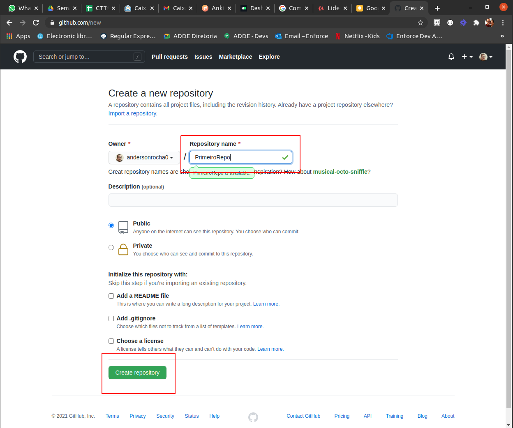
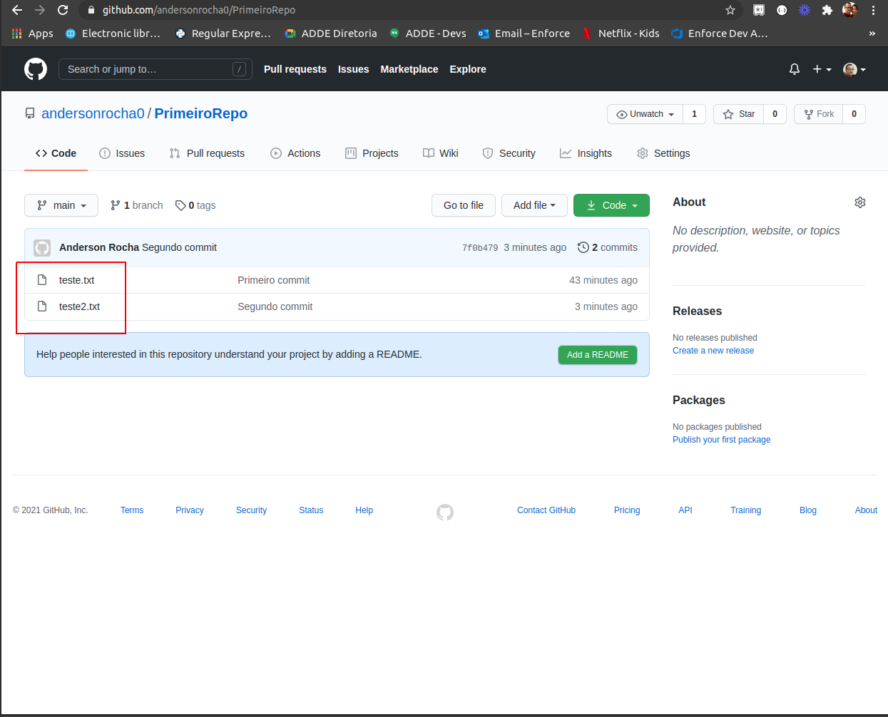

# Dia 6

## 1 - Git

### 1.1 - O que é git?

* Git é um sistema de controle de versão distribuída livre e de código aberto desenvolvido para lidar com pequenos e grandes projetos com velocidade e eficiência. (Frase adaptada para o português do site do git). Original:
    * Git is a free and open source distributed version control system designed to handle everything from small to very large projects with speed and efficiency.

* Com o git podemos gerenciar versões do nosso código/projeto mantendo um histórico de tudo que foi feito até chegarmos no estado atual.

* O Git é uma ferramenta de terminal com vários comandos que podem ser utilizados em diversos momentos durante o ciclo de vida do versionamento do código. Podemos listar versões, salvar códigos, voltar versões, criar novas versões a partir de versões anteriores e muitas outras possibilidades.

* O Git é distribuído pois permite que você crie um repositório localmente na sua máquina e só depois conecte ele a um remote (servidor), por exemplo GitHub. Sem dizer, que podemos conectar esse nosso código local a vários remotes simultaneamente. Quando enviamos nosso código para o remote, outros devs estão aptos a trabalhar a partir dele, enviar novos commits (salvar as alterações) e pegar novos commits(pegar as alterações). Isso significa que o acesso ao código, histórico, versões e tudo mais, está localizado na máquina de cada dev, e quando algo é modificado, **commitado** (alterações salvas) e **pushado** (alterações enviadas para o remote) essas alterações são centralizadas em um remote dando acesso a qualquer dev que tenha permissões **dar um pull** (pegar as alterações no remote e atualizar o seu código local) nas novas alterações para o seu sistema git local.

* O Git não é GitHub. O GitHub, assim como o GitLat, BitBucket entre outros, serve como remote (servidor) para os nossos códigos. Além disso, ele tem belas interfaces web que proporcionam uma usabilidade fantástica e também, algumas ferramentas acopladas, como por exemplo: ferramentas de pipeline, controle de tarefas, etc.

### 1.2 - O que é versionamento de código

"Durante o desenvolvimento de software o que fazemos é escrever arquivos. Arquivos estes que são compilados para código de máquina e rodam no nosso sistema operacional ou interpretados por um programa interpretador da linguagem de programação, como o Node.js que executa nossos arquivos da linguagem de programação JavaScript, mas no fim das contas são só arquivos.

Imagina um trabalho de escola ou de faculdade, onde escrevemos um documento para enviar aos nossos professores. Este arquivo tem versões, pois, quando escrevemos ele, começamos fazendo um pouco hoje, outro tanto amanhã, o restante depois, até chegar na versão final e entregarmos aos professores.

O mesmo acontece com código de programas: desenvolvemos o sistema em pequenos pedaços entregáveis e cada entregável é uma versão do nosso software.

Vamos pensar no exemplo de um site. Este site possui um menu superior, um logotipo da nossa marca no centro da tela, duas caixas de conteúdo logo abaixo e um rodapé com diversos links úteis ao visitante. Ao desenvolvermos este site, podemos fazer o menu superior e salvar uma primeira versão, depois adicionamos o logotipo ao centro e salvamos mais uma versão, colocamos uma ou as duas caixas de conteúdo (dependendo da complexidade delas) e então salvamos outra versão, por fim adicionamos o rodapé e temos a versão entregável do site.

Deste modo outras pessoas também poderiam trabalhar em nosso projeto e continuar a partir do ponto onde paramos.

Isso é versionamento de código."

**Texto removido integralmente do link**: https://woliveiras.com.br/posts/introdu%C3%A7%C3%A3o-a-versionamento-de-c%C3%B3digo-e-conhecendo-o-git/#IntroduoaversionamentodecdigoeGit

#### Se precisar de ajuda com a instalação do git, por favor assista esse vídeo gravado pelo nosso aluno Ronaldo.

https://drive.google.com/file/d/1xqVujqYe-VbblmoZhT5PbPUGmyvjLFG6/view


### 1.3 git init

* Esse comando serve para inicializarmos um repositório git na nossa máquina.
    * Vamos criar uma pasta chamada MeuPrimeiroProjetoGit;
    * Abrir essa pasta via terminal utilizando o comando **cd**;
    * E digitar o comando **git init**
```bash
mkdir MeuPrimeiroProjetoGit
cd MeuPrimeiroProjetoGit
git init
# Você receberá a seguinte mensagem no terminal
# Initialized empty Git repository in /home/usuario/MeuPrimeiroProjetoGit/.git/
```

### 1.4 git status

* Esse comando serve para nos mostrar o status atual do nosso git. Ele mostra se existem modificações a serem commitadas ou arquivos que não estão sendo rastreados no nosso repositório. Veremos vários exemplos abaixo com ele.


### 1.5 git add

* Esse comando serve para adicionarmos arquivos que contenham código a uma área do git que chama staging. Ao adicionarmos esse arquivo, o git começa a controlar modificações nele e a partir desse momento podemos realizar nosso tão sonhado commit.
    * Vamos criar um arquivo texto chamado teste.txt;
    * Dentro desse arquivo de texto iremos escrever a palavra teste na primeira linha;
    * Vamos salvar esse arquivo texto;
    * Agora, vamos digitar o comando git status aprendido anteriormente.
    * Ao digitar o comando git status veremos uma mensagem dizendo que existe um arquivo não rastreado, ou seja que não está na staging.
    * Vamos rodar o comando **git add .**
    * Agora vemos que o git está rastreando nosso arquivo text.txt

```bash
git status
#On branch master

#No commits yet

#Untracked files:
#  (use "git add <file>..." to include in what will be committed)
#	teste.txt

#nothing added to commit but untracked files present (use "git add" to track)
# ---

git add .
# ---

git status
#On branch master

#No commits yet

#Changes to be committed:
#  (use "git rm --cached <file>..." to unstage)
#	new file:   teste.txt
```

### 1.6 git commit -m "Mensagem de commit"

* Here we go. Esse comando gera uma versão no nosso repositório git. Isso significa que tudo que modificamos até aquele momento ficará registrado através de um código único de versão gerado pelo git.

    * Vamos rodar o commando **git commit -m "Primeiro commit"**

```bash
git commit -m "Primeiro commit"
git status
#On branch master
#nothing to commit, working tree clean
```

### 1.7 git log

* Com esse comando, podemos ver a linha do tempo de commits já realizados.
    * Vamos rodar o comando **git log**


```bash
git log
#commit 1ecc35b0d725bac1be714d30115ec75998e537f6 (HEAD -> master)
#Author: Anderson Rocha <anderson.rocha@addesistemas.com.br>
#Date:   Tue Jan 19 19:00:13 2021 -0300

#    Primeiro commit
```

Podemos observar aqui que fizemos o primeiro commit do nosso repositório e o código dele é aquela string bem grandona que começa com 1ecc...


## 2 - GitHub

* GitHub é um servidor/remote para o nosso repositório git. Ele é bem intuitivo e utilizado na comunidade dev. Permite que outros devs contribuam no seu projeto de várias formas, desde abertura de solicitações (issues) até mesmo solicitações de pull requests (envio de código) com melhorias para o seu projeto. É a casa de vários projeto OpenSource do mundo. 

### 2.1 Criando a conta no GitHub

* Para criar sua conta no GitHub basta entrar no site e clicar em SignUp. Tem uns prints pra ajudar a ver o que fazer e não se perder. :smiley:

<h1 align="center">
    
</h1>
<h1 align="center">
    
</h1>
<h1 align="center">
    
</h1>
<h1 align="center">
    
</h1>
<h1 align="center">
    
</h1>
<h1 align="center">
    
</h1>
<h1 align="center">
    
</h1>

### 2.2 Criando nosso primeiro repositório

* Para criar seu primeiro repositório no GitHub basta:
    * logar na sua conta;
    * Na página inicial no canto superior esquerdo, irá ter um botão **New**, clique nele;
    * Por enquanto, preencha somente o nome do repositório;
    * Clique no botão **Create Repository**

Também tem imagens para facilitar nos passos.

<h1 align="center">
    
</h1>
<h1 align="center">
    
</h1>
<h1 align="center">
    
</h1>


### 2.3 Enviando nosso código para o nosso remote

* Olhando a última imagem do nosso passo acima, vemos que o próprio GitHub retornou alguns comandos que podemos utilizar para criar nosso repo e conectá-lo ao remote/servidor. Vamos executar somente os três últimos comandos que estão circulados de vermelho na última imagem do passo anterior.

```bash
git branch -M main
git remote add origin https://github.com/andersonrocha0/PrimeiroRepo.git
git push -u origin main
# Enumerating objects: 3, done.
#Counting objects: 100% (3/3), done.
#Writing objects: 100% (3/3), 228 bytes | 228.00 KiB/s, done.
#Total 3 (delta 0), reused 0 (delta 0)
#To github.com:andersonrocha0/PrimeiroRepo.git
# * [new branch]      main -> main
#Branch 'main' set up to track remote branch 'main' from 'origin'.
```

**No lugar de andersonrocha0 e PrimeiroRepo use o seu usuário e o nome que você deu para o seu usuário**

Ao atualizar nossa página do repositório no GitHub, vemos que o nosso arquivo teste.txt já está aparecendo para nós. Huhull.

<h1 align="center">
    
</h1>


### 2.4 Novos comando no git (push, pull, remote)

#### 2.4.1 git remote -v

* Com esse comando podemos ver para qual servidor nosso repositório local git está apontando.

```
git remote -v
#origin	git@github.com:andersonrocha0/PrimeiroRepo.git (fetch)
#origin	git@github.com:andersonrocha0/PrimeiroRepo.git (push)
```


#### 2.4.2 git push

* com esse comando podemos enviar novas modificações para o nosso servidor.
    * Vamos criar o arquivo teste2.txt;
    * Vamos escrever o texto teste na primeira linha do arquivo;
    * Vamos dar uma olhada no **git status**;
    * Vamos adicionar o arquivo ao nosso controle **git add .**
    * Vamos commitar as mudanças **git commit -m "Segundo commit"
    * Vamos dar uma olhada no log **git log**;
    * Vamos fazer o nosso primeiro **git push**
    * Agora, atualizando a página do GitHub, podemos ver que nosso arquivo teste2.txt se encontra no nosso servidor.

```bash
git status
#On branch main
#Your branch is up to date with 'origin/main'.

#Untracked files:
#  (use "git add <file>..." to include in what will be committed)
#	teste2.txt

#nothing added to commit but untracked files present (use "git add" to track)
# ---

git add .
# ---

git commit -m "Segundo commit"
#[main 7f0b479] Segundo commit
# 1 file changed, 1 insertion(+)
# create mode 100644 teste2.txt
# ---

git log
#commit 7f0b479ed48ea0cf93f0c46d566f39388124067d (HEAD -> main)
#Author: Anderson Rocha <anderson.rocha@addesistemas.com.br>
#Date:   Tue Jan 19 19:39:24 2021 -0300

#    Segundo commit

#commit 1ecc35b0d725bac1be714d30115ec75998e537f6 (origin/main)
#Author: Anderson Rocha <anderson.rocha@addesistemas.com.br>
#Date:   Tue Jan 19 19:00:13 2021 -0300

#    Primeiro commit
# ---

git push
#Enumerating objects: 3, done.
#Counting objects: 100% (3/3), done.
#Delta compression using up to 12 threads
#Compressing objects: 100% (2/2), done.
#Writing objects: 100% (2/2), 249 bytes | 249.00 KiB/s, done.
#Total 2 (delta 0), reused 0 (delta 0)
#To github.com:andersonrocha0/PrimeiroRepo.git
#   1ecc35b..7f0b479  main -> main
```

<h1 align="center">
    
</h1>

#### 2.4.3 git pull

* Com esse comando podemos pegar modificações feitas por outros devs ou até por você mesmo. Você pode ter feito a alteração do computador do seu trabalho e quer pegar no seu computador em casa, ou até mesmo, fazer a alteração diretamente pela interface web do GitHub.
    * Vou fazer uma alteração no arquivo teste.txt diretamente no GitHub.
    * Vamos fazer um git log para ver que as alterações ainda não estão no meu git local.
    * Depois disso, vamos fazer um **git pull** para receber essas alterações localmente.
    * Novamente com o git log, podemos ver que houve uma alteração feita diretamente no GitHub.

```bash
git log
#commit 7f0b479ed48ea0cf93f0c46d566f39388124067d (HEAD -> main, origin/main)
#Author: Anderson Rocha <anderson.rocha@addesistemas.com.br>
#Date:   Tue Jan 19 19:39:24 2021 -0300

#    Segundo commit

#commit 1ecc35b0d725bac1be714d30115ec75998e537f6
#Author: Anderson Rocha <anderson.rocha@addesistemas.com.br>
#Date:   Tue Jan 19 19:00:13 2021 -0300

#    Primeiro commit
#---

git pull
#remote: Enumerating objects: 5, done.
#remote: Counting objects: 100% (5/5), done.
#remote: Compressing objects: 100% (2/2), done.
#remote: Total 3 (delta 0), reused 0 (delta 0), pack-reused 0
#Unpacking objects: 100% (3/3), 712 bytes | 712.00 KiB/s, done.
#From github.com:andersonrocha0/PrimeiroRepo
#   7f0b479..b829d2d  main       -> origin/main
#Updating 7f0b479..b829d2d
#Fast-forward
# teste.txt | 3 ++-
# 1 file changed, 2 insertions(+), 1 deletion(-)
#---

git log
#commit b829d2dcc27158a96c2c407d4089b512cb016f61 (HEAD -> main, origin/main)
#Author: Anderson Rocha <anderson-rocha@outlook.com>
#Date:   Tue Jan 19 19:46:36 2021 -0300

#    Modificando arquivo diretamente no GitHub

#commit 7f0b479ed48ea0cf93f0c46d566f39388124067d
#Author: Anderson Rocha <anderson.rocha@addesistemas.com.br>
#Date:   Tue Jan 19 19:39:24 2021 -0300

#    Segundo commit

#commit 1ecc35b0d725bac1be714d30115ec75998e537f6
#Author: Anderson Rocha <anderson.rocha@addesistemas.com.br>
#Date:   Tue Jan 19 19:00:13 2021 -0300

#    Primeiro commit
```


## Referências

### Sites na Web

* https://git-scm.com/

* https://woliveiras.com.br/posts/introdu%C3%A7%C3%A3o-a-versionamento-de-c%C3%B3digo-e-conhecendo-o-git/#IntroduoaversionamentodecdigoeGit