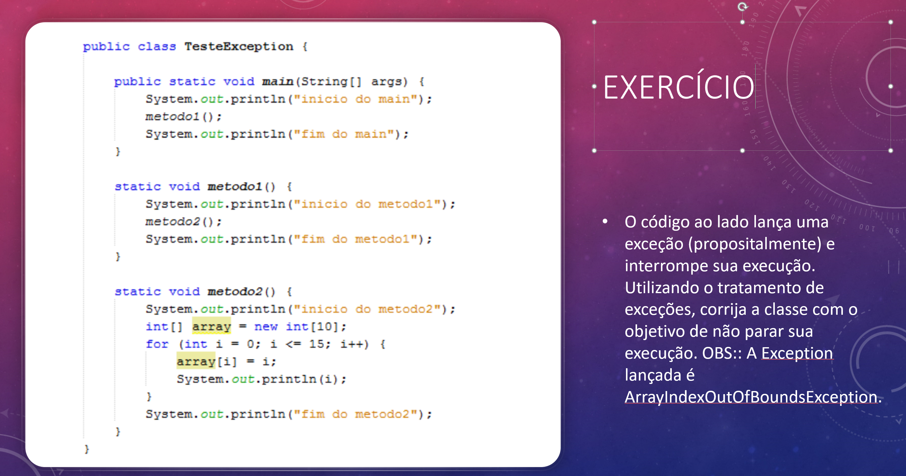

# Exercicios de Avaliação

1. Escreva uma classe que represente um país. 
    * Um país é representado através dos atributos: código ISO 3166-1 (ex.: BRA), nome (ex.: Brasil), população (ex.: 193.946.886) e a sua dimensão em Km2 (ex.: 8.515.767,049). Além disso, cada país mantém uma lista de outros países com os quais ele faz fronteira. 
  
    * Escreva a classe e forneça os seus membros a seguir: 
    Construtor que inicialize o código ISO, o nome e a dimensão do país;
    Métodos de acesso (getter/setter) para as propriedades código ISSO, nome, população e dimensão do país; 
   *  Um método que permita verificar se dois objetos representam o mesmo país (igualdade semântica). Dois países são iguais se tiverem o mesmo código ISO;
   * Um método que informe se outro país é limítrofe do país que recebeu a mensagem;
   * Um método que retorne a densidade populacional do país; 
   * Um método que receba um país como parâmetro e retorne a lista de vizinhos comuns aos dois países. Considere que um país tem no máximo 40 outros países com os quais ele faz fronteira.

2. Escreva uma classe Continente. 
    * Um continente possui um nome e é composto por um conjunto de países. 
    * Forneça os membros de classe a seguir: 
    * Construtor que inicialize o nome do continente; 
    * Um método que permita adicionar países aos continentes; 
    * Um método que retorne a dimensão total do continente; 
    * Um método que retorne a população total do continente;
    * Um método que retorne a densidade populacional do continente; 
    * Um método que retorne o país com maior população no continente; 
    * Um método que retorne o país com menor população no continente; 
    * Um método que retorne o país de maior dimensão territorial no * continente; 
    * Um método que retorne o país de menor dimensão territorial no * continente; 
    * Um método que retorne a razão territorial do maior pais em relação ao menor país.

3. Fazer um programa com as seguintes características:

* Uma classe chamada Universidade que terá como atributo um nome e terá um  método para informar o seu nome. 
* Uma classe Pessoa, que terá como atributo seu nome, em que universidade * trabalha e em quando entrou na universidade um método que dirá seu nome e * em que universidade trabalha. 
* Relacionar a classe Pessoa para com a classe Universidade. Cada pessoa poderá ser associada a uma Universidade. 

4. Crie uma classe Televisão e uma classe ControleRemoto que pode controlar o volume e trocar os canais da televisão. O controle de volume permite:

* aumentar ou diminuir a potência do volume de som em uma unidade de cada vez;
* aumentar e diminuir o número do canal em uma unidade
* trocar para um canal indicado;
* informar o valor do volume de som e o canal selecionado.
* Um ControleRemoto tem uma Televisão

5. Escreva uma classe Agenda
 
* contém vários contatos do tipo Contato.
* Cada contato possui nome, telefone e email.
* Agenda também possui um nome.
* Crie métodos que retornam uma String com a informação de cada contato

6. Escreva uma classe Curso

* Que possui nome e horário.
* Cada curso tem Professor
* Professor possui nome, departamento e email.
* Cada Curso também pode ter vários alunos(tipo Aluno).
* Cada aluno tem nome, matricula e 4 notas.
* Crie metodos para calcular a media final do aluno. 
* Crie metodo para verificar se o aluno está aprovador(media maior ou igual a 7).
* Crie um metodo para calcular a media da turma

7. <h1 align="center">
   
  
   
</h1> 

8.  <h1 align="center">
   
  
   
</h1> 

9. Escreva uma classe ConversaoDeUnidadesDeTempo com metodos estáticos para conversão aproximada de velocidade segundo a lista abaixo.

* 1 minuto = 60 segundos
* 1 hora = 60 minutos
* 1 dia = 24 horas
* 1 semana = 7 dias
* 1 mês = 30 dias
* 1 ano = 365 dias

10. Escreva uma classe Calculadora que tenha os métodos cada metodo recebe dois parametros: 

* somar
* subtrair
* multiplicar
* dividir
* elevar a potência n.
  